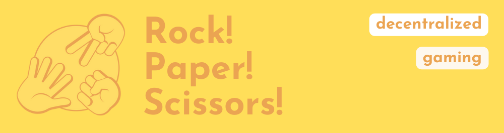
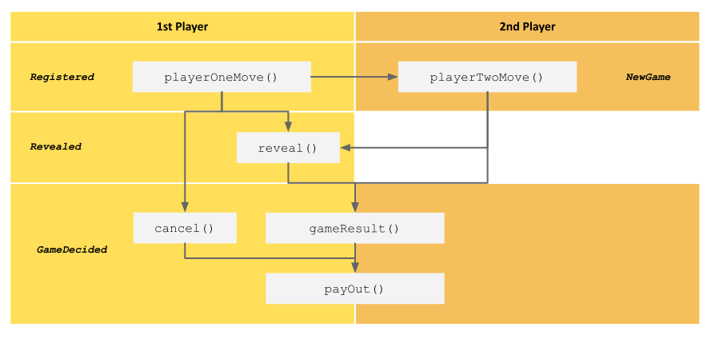

## Table of Contents

- [Rock Paper Scissors as a Gaming Dapp](#rock-paper-scissors-as-a-gaming-dapp)
- [The Gameplay](#the-gameplay)
- [Smart Contract Implementation](#smart-contract-implementation)
- [Summary of this Gaming DApp](#summary-of-this-gaming-dapp)
- [How to clone this DApp](#how-to-clone-this-dapp)
- [Disclaimer](#disclaimer)


## Rock Paper Scissors as a Gaming DApp
In systems with a distributed ledger like the **Ethereum blockchain**, things must be handled differently than usually. To illustrate some key characteristics – like **Public on-chain data and trustless interactions** – the classic Game _Rock Paper Scissors_ was adjusted accordingly.

In the common gameplay, two players play at the same time. This means, that they play synchronous/simultaneous and reveal their choice – of one of three shapes with an outstretched hand – at the same time. Directly thereafter, based on the game result, the winnings on the bet getting distributed. Theoretically this gameplay is fair by definition and could create random results/winners similar to a coin flip. Even though, practically, an adversary could be exploiting his opponent by reading his/her body language like in a poker game.

### What changes in a decentralized version of the game?
Pretty much, in order to adapt the rules of the traditionally synchronous to an asynchronous setting:
1. Player's are playing asynchronous, mean that each move not occurs at the same time. Or more precisely, in separate transactions and blocks which get attached to the blockchain. 
2. Therefore, gameplay needs to be serialized in form of separate instructions in a smart contract.
3. And because everything on-chain is by design public, the 1st Player needs to hide his choice of hand with the help of cryptography.

As a result of these adjustments, it's probably a fair game, although there are no middlemen involved. The power lies in the transparency and incentivized model of smart contracts.

## The Gameplay
As the keyword _Dapp_ in the title implies, this game consists of a backend (smart contracts running on the Ethereum blockchain) and a frontend (client-side speaking to the blockchain). In the following, the gameplay is described based on the frontend user interface.

**For a Live-Version of the Dapp check out:** [https://gaming-dapp-rock-paper-scissors.netlify.app/](https://gaming-dapp-rock-paper-scissors.netlify.app/)

### Get Ready: Connect Wallet & Approve Tokens
Before a User can start a new game or joining and existing one, two things are required. First, the User need to connect with his wallet (as in any other DApp). Secondly, the User needs to approve tokens to the _Rock Paper Scissors_ game contract, so that this contract can secure the bet's on his behalf. In this example, DApp, there is a faucet to get some game token to play around with.


### 1. Start a Game 
A User selects his desired hand and the amount of tokens to bet with. As seen in the tooltip of the _Start Game_ button, a random 10-digit password is automatically generated in the background, in order to use it for hiding his hand (see [Smart Contract Implementation](#smart-contract-implementation)). After a new game was started and the related transaction is mined on the blockchain, the game is _open_ and ready for a 2nd player.


### 2. (Or) Join a Game
A User can join an existing game as 2nd player, if there is already one open. In order to join, the User needs to select his desired hand and accepting a  pot size bet when signing the transaction after clicking _Join this Game_. If so, a new game round officially started and the game will be listed under _Running_ Games.
If nobody can be found to join an open game round, the 1st player has the possibility to cancel his bet after a `CANCEL_TIMEOUT` (of currently 5 mins.).


### 3. Running Games
The User who is the 1st player can now reveal his hand until the `REVEAL_TIMEOUT` passed by. After that, both players can call for the game result of the game round they are in. So the game round is decided.


### 4. Results
Finally User's can review the results and played hand's of the last 20 games. The hand of the 1st player is only visible if he revealed his hand. In addition, a game statics shows the distribution of all (visible) hands played in the past.


## Smart Contract Implementation
In the following, some answers to key considerations and underlying design decisions made.
### How the game was serialized?
As visualized in the following graphic, the game flow is separated into four stage, in-line with the emitted event's:
1. `Registered` with the execution of `playerOneMove(bytes32 hash, uint256 bet, address tokenAddress)`. The `hash` is used to hide the choice of the 1st player. The `bet` is the amount of token of this `tokenAddress`.
3. `NewGame` with the execution of `playerTwoMove(bytes32 hash, Hand hand)`. The initial `hash` of the 1st player is used a key to reference to the game round along all further function calls. The `hand` needs to be an enum of `Hand { Rock, Paper, Scissors }`. Therefore, the 2nd player does not hide his hand, because it's no needed cause the 1st player can't exit the game after the `playerTwoMove`. 
4. `Revealed` with the execution of `reveal(Hand hand, string memory password, bytes32 hash)`.
5. `GameDecided` with the execution of `gameResult(bytes32 hash)` or `cancel(bytes32 hash)`.



### How the hand of the 1st player gets hidden?
In order to hide private data (like the hand) on a public ledger, there is a cryptographic primitive, called _commitment scheme_. It basically separates the release of information in two phases. Firstly: commit of a hash generated out specific values – in this case it's the `hand`, along with a `password` and the address on the `msg.sender` – see `hashHelper()`. Secondly: Revealing these initially encoded values. For this reason, it is also called the _commit reveal scheme_. There is one more important detail to add: The hash get stored in order to compare it with the hash which need to be reassembled based on the values, the user want to reveal. If both hashes are not match, the smart contract throws.

### How to deal with unreliable participants?
In order to not tie up one of the player's if something unexpected and evil happens, there always needs to be a way out. In this case, there are two game requirements which needs to fulfilled in order to get to the game result. The 1st player could possibly wait endlessly if nobody wants to join this game round. Two give this player the way out, he can cancel (after a `CANCEL_TIMEOUT`) which leads to a refund. Similar thing if a game is already running, but the 1st player does not reveal his hand. Then the 2nd player can drag along the other one (after a `REVEAL_TIMEOUT`) to get the game result and the complete pot.

### Smart Contracts are deployed on the Görli Network (Testnet for the Ethereum Mainnet)
1. Game Contract => RockPaperScissors.sol, [0x52CCE0aD2eBE3C06ef98483c2319ff972A78DD0f](https://goerli.etherscan.io/address/0x52CCE0aD2eBE3C06ef98483c2319ff972A78DD0f)
2. ERC20 Token Contract => YooToken.sol, [0x9fF8f32fe3CC80C91e1284f54E023e1450f849D4](https://goerli.etherscan.io/address/0x9fF8f32fe3CC80C91e1284f54E023e1450f849D4)

## Summary of this Gaming DApp

### Features
**Frontend User Interface (UI):**
- User can connect to the DApp via different wallets (MetaMask, Walletconnect, Coinbase). 
- User can request an ERC20 (Game) Token (and some Görli ETH) via a gasless Token Faucet
- User can approve this ERC20 (Game) Token to the smart contract of the game.
- User can navigate trough existing games separated by it state (open, running, decided).
- User can see how long a game is already open or running. 
- User can start a new game and define the stake of the game round with tokens (currently only one Token is whitelisted). 
- User can cancel a game that he started, if no one joins after a specific time (currently 5 mins.).
- User can join an open game.
- User can reveal his hand, if he started the game round, a second player joined and the REVEAL_TIMOUT doesn't pass by (initial move gets restored via local web storage).
- User can call for the game results of a game round if he is a player of this round, the 1st player revealed his hand or if he's the 2nd player and the REVEAL_TIMOUT passed by.
- User received tooltips and notifications while interacting with the UI.
- User get the latest update as the state of a game changes. Updates are indicated by showing the latest block number.

**Smart Contract:**
- Playable with ERC20 Token 
- Whitelisting ERC Token via AccessControl

### Used Tech
**Frontend:** React, Vite, Material UI, ethers.js, wagmi, I18next, (Misc.: react-router, prop-types, react-toastify, use-local-storage-state)

**Backend:** Solidity, OpenZeppelin Libraries and Defender (Relay, Autotask), Alchemy & Infura (for RPC), Etherscan (for block exploring & verification) Netlify (for Deployment UI)

And for development and testing: Hardhat, truffle-assertions, chai, solidity-coverage

## How to clone this DApp
1. `git clone https://github.com/JorisZierold/gaming-dapp-rock-paper-scissors.git`
2. `cd rock-paper-scissors/app`
3. `npm install`
4. create `.env` inside `gaming-dapp-rock-paper-scissors/app`directory
```
VITE_ALCHEMY_ID=
VITE_ETHERSCAN_API_KEY=
VITE_INFURA_ID=
VITE_CONTRACT_RPC=0x52CCE0aD2eBE3C06ef98483c2319ff972A78DD0f
VITE_CANCEL_TIMEOUT=300
VITE_REVEAL_TIMEOUT=300
VITE_MIN_BET_IN_ETH=1
VITE_CONTRACT_TOKEN=0x9fF8f32fe3CC80C91e1284f54E023e1450f849D4
VITE_TOKEN_NAME=YooToken
VITE_TOKEN_SYMBOL=Yoo
VITE_CONTRACT_MINIMAL_FORWARDER=
VITE_CONTRACT_TOKENFAUCET=
VITE_OZ_AUTOTASK_KEY=
```
5. run `npm run dev` inside `gaming-dapp-rock-paper-scissors/app`directory 
6. visit `http://localhost:3000/`


## Disclaimer
This repository is for educational purpose only! 

Feel free to use the content of this repository, as long as you make a proper credit notes and don't pass it off as your work.
